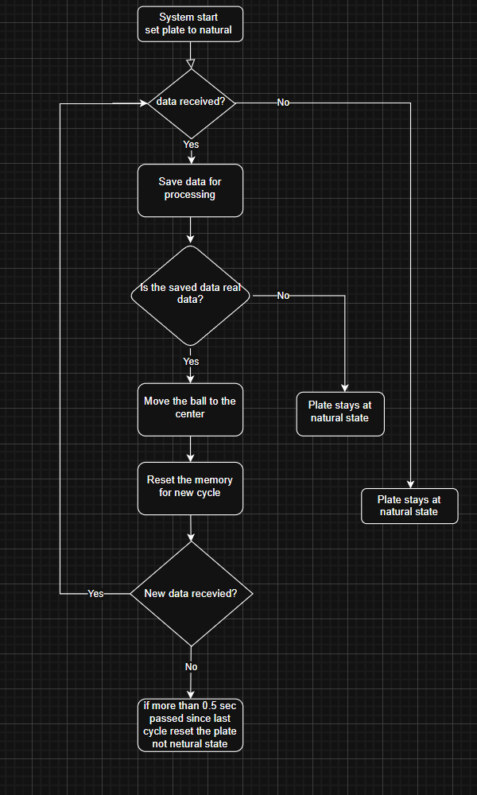

\# ⚙️ Ball Balancing Robot – STM32 Blue Pill

This repository contains only the \*\*STM32 firmware\*\* for the ball balancing robot.

The mechanical and computer vision subsystems are excluded.

The code is written fully in C (HAL-based) and tested on STM32CubeIDE.

It implements real-time control, PID stabilization, and inverse kinematics logic.

The \*\*mechanical structure\*\* and \*\*computer vision system\*\* are developed separately and are \*\*not included here\*\*.

---

\## 🧠 Project Overview

The system aims to balance a ball on a flat platform using three servo motors.

The STM32 Blue Pill receives the ball’s coordinates (X, Y) from an external computer vision module via USB.

Then it calculates the required platform tilt using:

\- \*\*PID Control\*\* – to minimize the distance between the ball and the center.

\- \*\*Inverse Kinematics\*\* – to determine each servo’s target angle.

\- \*\*PWM Output\*\* – to drive the servos precisely in real time.

The STM32 runs the full control logic independently.

---

\## 🛠️ Hardware Used

| Component | Description |

|------------|--------------|

| STM32 Blue Pill (STM32F103C8T6) | Main microcontroller |

| ST-LINK V2 | Programmer / Debugger |

| 3x Servo Motors | Platform actuators |

| Breadboard + Jumpers | Connections |

| USB Connection | For serial communication (CDC) |

---

 Project Structure 

📂 Core/
 ├── Inc/
 │   ├── main.h                → Header for main.c
 │   ├── shared_variables.h    → Global variables declarations
 │   ├── Control_Functions.h   → Function declarations for control algorithms
 │
 └── Src/
     ├── main.c                → System initialization + main control loop
     ├── shared_variables.c    → Shared global variables between modules
     ├── Control_Functions.c   → PID + Servo control + inverse kinematics
     ├── usbd_cdc_if.c         → Handles USB communication (auto receive callback)

📂 Media/
 ├── Code_logic.png            → Diagram showing STM32 control flow

📂 Resources/
 ├── Full_Project_Ready_to_Run.zip  → Complete project for STM32CubeIDE (ready to open and flash)

📄 README.md                   → Full project explanation for GitHub
📄 Project_Structure.md        → Project structure and file overview
📄 .gitignore                  → Files to be ignored by GitHub

\## 🧩 Code Architecture

| File | Description |

|------|--------------|

| `main.c` | System initialization + main control loop |

| `Control\\\_Functions.c` | Contains PID, servo control, and inverse kinematics logic |

| `shared\\\_variables.c` | Holds all shared variables and constants |

| `usbd\\\_cdc\\\_if.c` | USB receive callback (auto-triggered by middleware) |

| `shared\\\_variables.h` | Global variables header |

| `Control\\\_Functions.h` | Control functions declarations |

---

\## 🧰 How to Run the Project

All STM32 source codes are already uploaded above and ready to use.

If you want to explore or modify the control logic, you can open the source files directly.

For those who prefer to test the full project in STM32CubeIDE without manual setup,

a \*\*ZIP file\*\* containing the complete, ready-to-run project is also included in this repository.

Simply download the ZIP file, extract it, and open the project in STM32CubeIDE.

---

\## 🧪 Expected Behavior

\- When the ball is detected, the platform tilts to push it toward the center.

\- When no ball is detected, servos return to default neutral angles.

\- The system continuously runs in real time, updating every ~20 ms.

